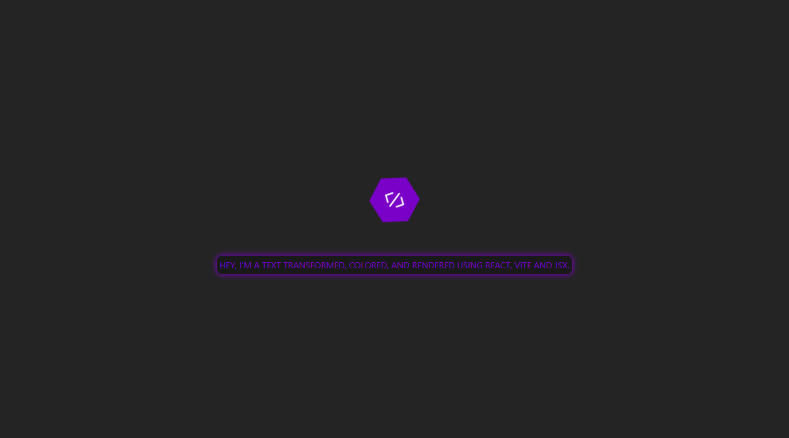
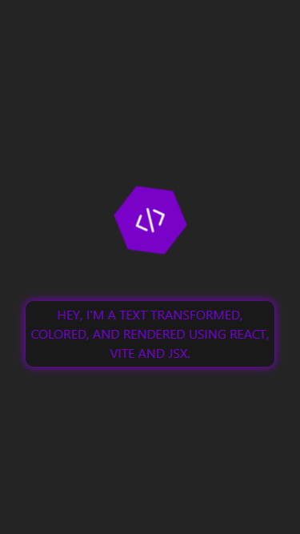

# DevQuest - React Base

## Languages

This first section is in English.

[Versão em português logo abaixo.](#portuguese)

## Context

This is a solution to the React Base challenge from the [DevQuest course](https://evento.devemdobro.com/matriculas-abertas).

From this challenge, I needed to:

> 1. Render a component that colors and transforms a text to uppercase:
>
> - Give your component a good name
> - Make the component render a colored paragraph on the screen with all capital letters
> - Use `props` to pass the text and the desired text color into the component (the color can be a word, such as 'red', or a hexadecimal)
> - You can use the inline style to color the component as shown in the classes
>
> 2. Create a Button component with a click event that display an alert informing the label prop of the clicked button:
>
> - The alert should be "The label of this button is `<insert the label here>`"

## Table of contents

- [Overview](#overview)
  - [Screenshot](#screenshot)
  - [Links](#links)
- [My process](#my-process)
  - [Built with](#built-with)
  - [What I learned](#what-i-learned)
- [Author](#author)

## Overview

### Screenshot

#### Desktop

<p align="center">
  
</p>

#### Mobile

<p align="center">
  
</p>

### Links

- Solution URL: [GitHub Repository](https://github.com/xuaun/DevQuest-React-Base)
- Live Site URL: [Live Page](https://xuaun.github.io/DevQuest-React-Base/)

## My process

### Built with

- Semantic HTML5 markup
- CSS custom properties
- JavaScript & JSX
- [React](https://react.dev/learn) & [Vite](https://vite.dev/guide/)

### What I learned

I learned how to use React (with Vite + JSX) to render components on the screen, as well as pass values ​​to the components using `props`.

It was my first project using React and I'm very happy with how it turned out.

```js
// App.jsx
<>
  <Button label={label} />
  <UppercaseColoredParagraph paragraph={text} color={color} />
</>;

// uppercaseColoredParagraph.jsx
return (
  <p style={{ color: props.color, textTransform: "uppercase" }}>
    {props.paragraph}
  </p>
);
```

## Author

- Website - [João Víctor de Araujo Lima's Portfolio](https://xuaun.github.io/)
- Frontend Mentor - [@xuaun](https://www.frontendmentor.io/profile/xuaun)

---

<br>

# <p id="portuguese"> DevQuest - React Base</p>

## Contexto

Esta é uma solução para o desafio de React Base do [curso DevQuest](https://evento.devemdobro.com/matriculas-abertas).

A partir disso, foram feitas algumas solicitações:

> 1. Renderizar um component que colorisse e transformasse um texto todo em maiusculo:
>
> - Dar um bom nome ao componente
> - Fazer com que o componente renderizasse um paragrafo colorido na tela com todas as letras maiusculas
> - Usar `props` para passar o texto e a cor desejada ao componente (a cor poderia ser uma palavra, como 'red', ou um hexadecimal)
> - Você pode usar o inline style para colorir o componente como mostrado em aula
>
> 2. Criar um componente Button com um evento de clique que dispara um alerta informando a prop label do botão clicado:
>
> - O alerta deveria ser "A label desse botão é `<insira a label aqui>`"

## Lista de conteúdos

- [Visão Geral](#visão-geral)
  - [Prints](#prints)
  - [Links](#links-pt)
- [Meu processo](#meu-processo)
  - [Tecnologias utilizadas](#tecnologias-utilizadas)
  - [O que eu aprendi](#o-que-eu-aprendi)
- [Autor](#autor)

## Visão Geral

### Prints

#### Computador

<p align="center">
  
</p>

#### Celular

<p align="center">
  
</p>

### <p id="links-pt">Links</p>

- Link da solução: [Repositório no GitHub](https://github.com/xuaun/DevQuest-React-Base)
- Site com a solução: [Página do projeto no ar](https://xuaun.github.io/DevQuest-React-Base/)

## Meu processo

### Tecnologias utilizadas

- HTML5
- CSS
- JavaScript & JSX
- [React](https://react.dev/learn) & [Vite](https://vite.dev/guide/)

### O que eu aprendi

Eu aprendi a usar o React (com o Vite + JSX) para renderizar componentes na tela, além de passar valores para os componentes usando `props`.

Foi meu primeiro projeto usando React e estou bem feliz de como ele ficou.

```jsx
// App.jsx
<>
  <Button label={label} />
  <UppercaseColoredParagraph paragraph={text} color={color} />
</>;

// uppercaseColoredParagraph.jsx
return (
  <p style={{ color: props.color, textTransform: "uppercase" }}>
    {props.paragraph}
  </p>
);
```

## Autor

- Website - [Portfólio - João Víctor de Araujo Lima](https://xuaun.github.io/)
- Frontend Mentor - [@xuaun](https://www.frontendmentor.io/profile/xuaun)
